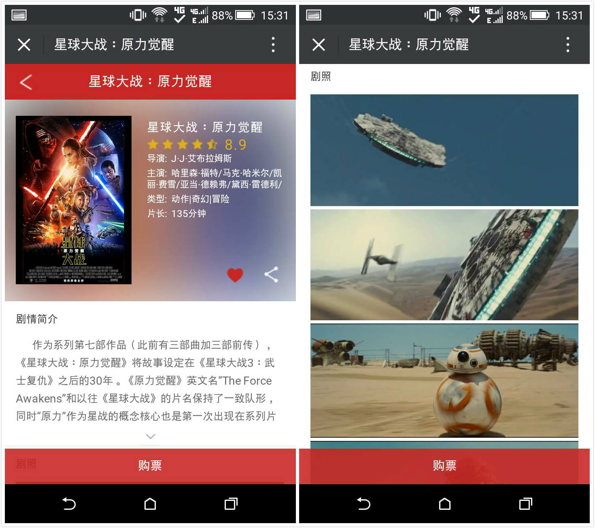
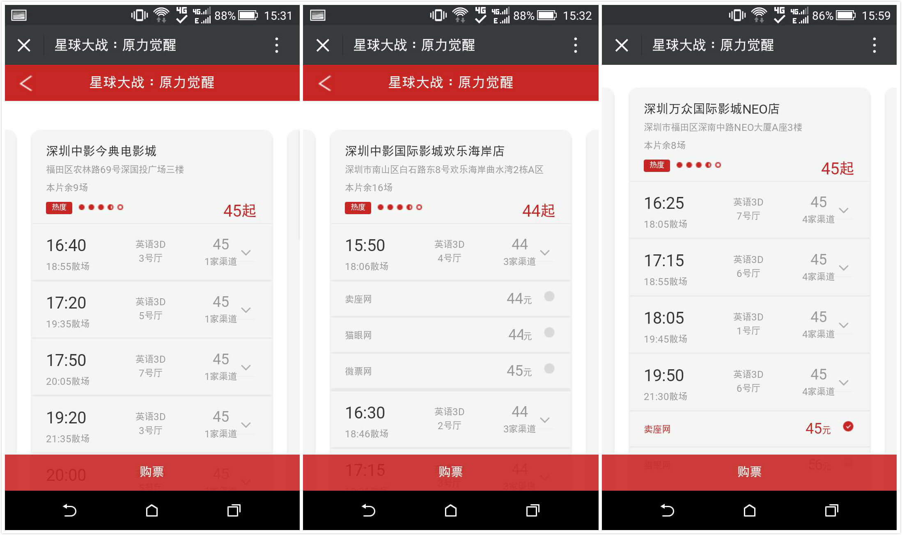

# my-frontend-projects

我的前端项目集, 基本上是独立开发完成, 由于初入前端赶需求时间仓促, 部分代码未必非常优雅, 放在这里仅作为收集与展示。

所有后端逻辑已删除关键配置信息, 需要补全才能跑起来。

* [微信电子名片](#user-content-wechatCard)
* [果维素经销系统未完成版](#user-content-guoweisu)
* [撸电影手机网站](#user-content-luMovie)
* [Video手机去广告观看视频](#user-content-video)
* [电影票比价手机网站](#user-content-movie)
* [移动端九宫格抽奖活动](#user-content-lottery)
* [大数据后台移动端Demo版](#user-content-bigData)
* [微信端视频播放网站Vegotv](#user-content-vegotv)
* [多媒体视频类App](#user-content-mobileApp)

<h3 id="wechatCard">微信电子名片 (2015-9)</h3>

微信电子名片, 即时生成你的专属电子名片,引用百度上传控件webuploader上传,再上传到七牛获取url

<h3 id="luMovie">撸电影手机网站 (2015-11)</h3>

通过后台上传电影到七牛,获取链接信息,渲染页面,并判断终端是PC或手机做不同处理

<h3 id="video">Video手机去广告观看视频 (2015-11)</h3>

系统架构在laravel框架上,爬取优酷视频,分类平台去广告观看.(后台代码已删除!)

<h3 id="movie">电影票比价手机网站 (2015-12)</h3>

系统架构在laravel框架上,通过爬取猫眼,卖座,时光,微票等电影售票网站价格,地点,以及电影院上映时间等信息,调取本地坐标接口获取距离,依据距离由近到远排序,再依据电影院售票价格做比价调整.最后用户可以依据价格直接依据已选场次在各售票网站买票(整个项目前端部分本人占3/5,爬取信息以及信息整理非本人所写,所以后台代码已删除,这里特此声明!)

<h3 id="lottery">移动端九宫格抽奖活动 (2016-1)</h3>

九宫格转盘抽奖活动,适配各手机移动端浏览器.

<h3 id="bigData">大数据后台移动端Demo版 (2016-3)</h3>
精准化营销大数据后台管理系统移动端Demo版,适配手机及ipad,构建在PHP的Laravel框架之上,后台接口与相关数据已删除,展示仅保留前端样式及逻辑代码

<h3 id="vegotv">微信端视频播放网站Vegotv (2016-9)</h3>
跑在移动端上(主要是微信端)的一个网络电视播放网站,本人负责全部的页面及逻辑开发、以node作为服务中间层的api接口开发以及以微信为依托的分享以及相应服务,微信登陆及付费非本人开发,相应代码及后台相关接口及配置信息都已删除,代码仅作记载及展示.

<h3 id="mobileApp">多媒体视频类App (2016-12)</h3>

项目是一款针对海外华人市场,集成youtube视频分类的自媒体App,首页及频道页UI布局和逻辑、个人中心页布局、项目所有缓存抽象管理、部分node api中间层 为本人所写,技术选型为:

* react负责前端页面逻辑
* react-router负责页面路由
* redux负责状态管理
* webpack打包
* nodejs 后台api
* falcor-api接口模型
* cordova-android及ios打包

___

